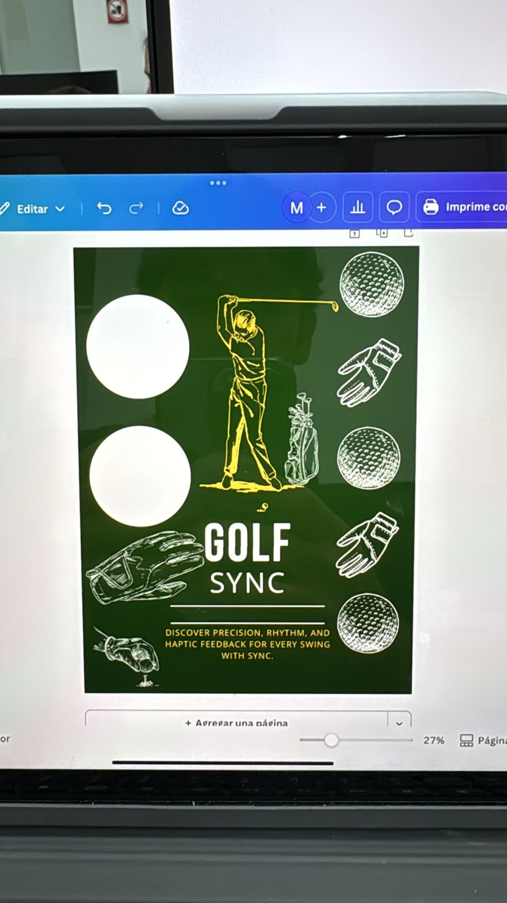
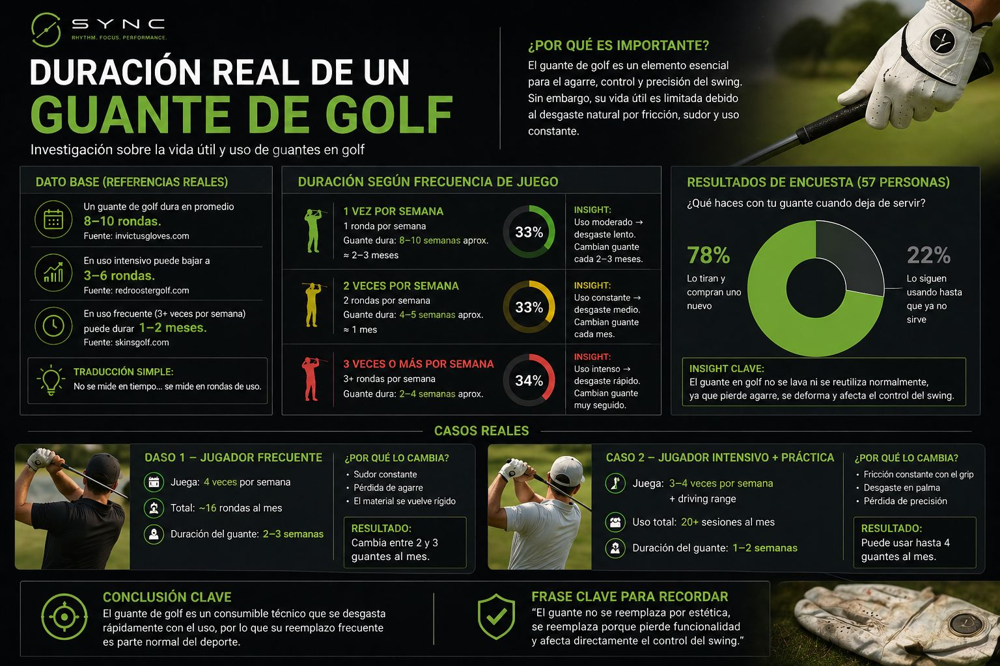

# Concepto

> **Ponderación:** 10%

---

## Idea central

**Golf Sync** es un sistema wearable de análisis de swing de golf en tiempo real. Un sensor IMU (acelerómetro + giroscopio + magnetómetro) montado en el guante captura el movimiento durante el swing; los datos se transmiten vía Bluetooth Low Energy a una aplicación Android que los envía a un backend de Machine Learning. En segundos, el jugador recibe un veredicto **GOOD / BAD**, un porcentaje de confianza y un desglose de las métricas que más influyeron en la clasificación.

El sistema corre de forma completamente autónoma: el sensor tiene batería propia, la app funciona en cualquier teléfono Android, y el backend corre en Docker en una PC accesible desde cualquier red mediante Tailscale.

---

## Motivación

El swing de golf es una de las habilidades motrices más difíciles de mejorar. La retroalimentación técnica de calidad —cámaras de alta velocidad, sensores profesionales, análisis con entrenador— es costosa e inaccesible para el jugador aficionado.

La investigación de usuario reforzó otro problema: el **guante de golf es un consumible técnico** que el 78% de los jugadores descarta y reemplaza regularmente por desgaste. Si el guante ya se cambia con frecuencia, integrarlo con electrónica de bajo costo no destruye un objeto de valor permanente.

El proyecto parte de esa intersección: un sensor discreto montado en un guante existente, conectado a un pipeline de ML corriendo en el teléfono del jugador, sin depender de ninguna infraestructura del campo de golf.

---

## Objetivos de diseño

- **RF-01 — Captura de movimiento:** medir aceleración, velocidad angular y orientación a ≥70 Hz durante el swing completo.
- **RF-02 — Transmisión inalámbrica:** enviar los datos en tiempo real al teléfono vía BLE sin cables visibles ni latencia que interrumpa el swing.
- **RF-03 — Clasificación automática:** detectar el swing, extraer sus 19 métricas características y clasificarlo como GOOD o BAD usando un modelo Random Forest.
- **RF-04 — Retroalimentación inmediata:** mostrar el veredicto, la confianza y el desglose de features en la app en menos de 2 segundos tras terminar el swing.
- **RF-05 — Historial y mejora continua:** guardar cada swing analizado en una base de datos local y permitir re-etiquetar y re-entrenar el modelo desde la propia app.
- **RF-06 — Portabilidad:** funcionar tanto en red local WiFi como desde cualquier red (campo de golf, exterior) mediante Tailscale.

---

## Usuario o contexto de uso

El usuario objetivo es el **golfista aficionado o semiprofesional** que practica regularmente y quiere mejorar su técnica sin contratar un entrenador permanente. Usa un teléfono Android, juega en driving ranges o campos, y quiere retroalimentación objetiva y accionable después de cada swing — no estadísticas pasivas.

El sistema es especialmente útil en sesiones de práctica donde el jugador repite el mismo movimiento decenas de veces: cada swing queda registrado, clasificado y disponible para revisar su evolución en la pantalla History de la app.

---

## Referencias e inspiración

*Figura — Identidad visual del proyecto Golf Sync: "Discover precision, rhythm, and haptic feedback for every swing."*

*Figura — Investigación sobre la duración real de un guante de golf: datos de 57 personas que confirman que el guante es un consumible, no un objeto de valor permanente.*

---

## Siguiente sección

[Metodología de diseño](metodologia.md)
