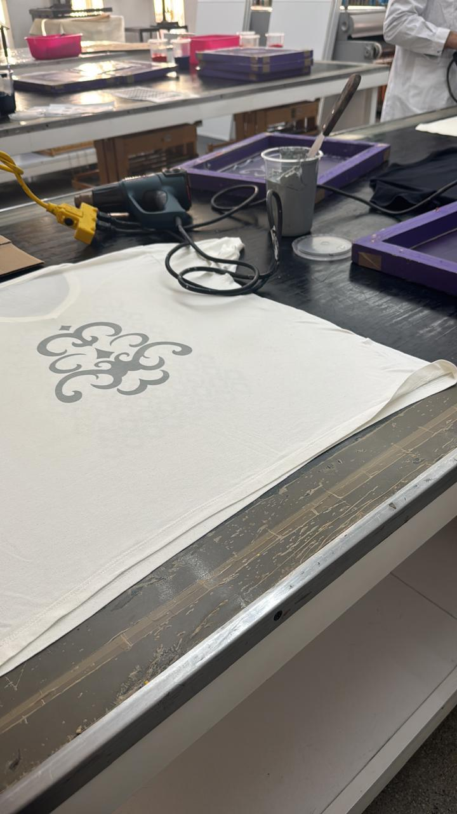
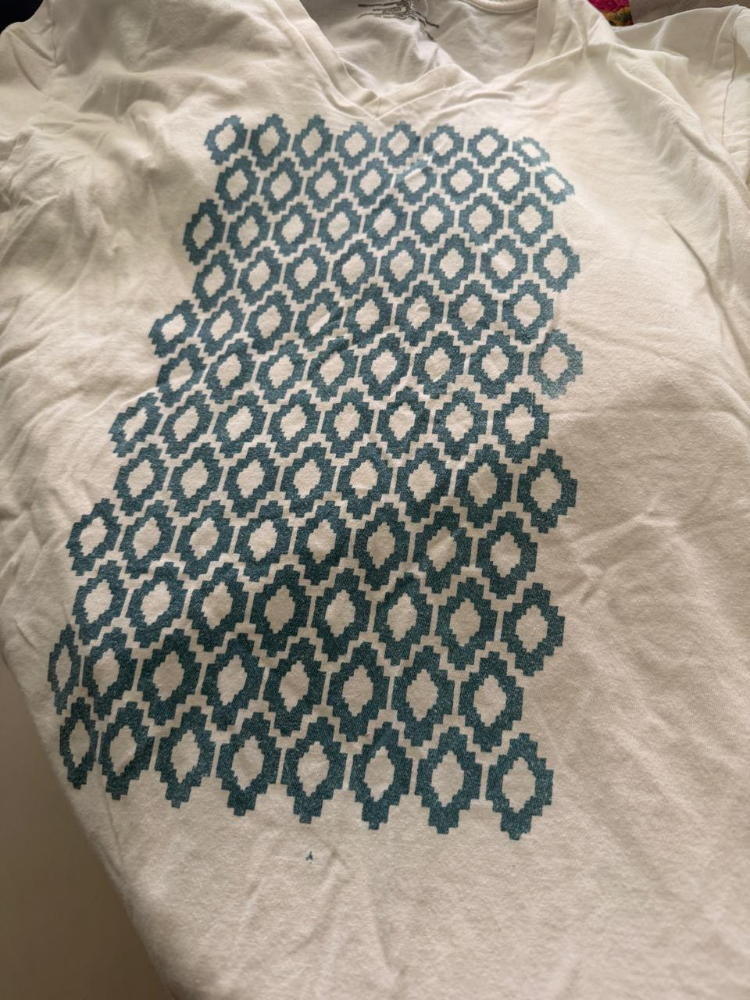
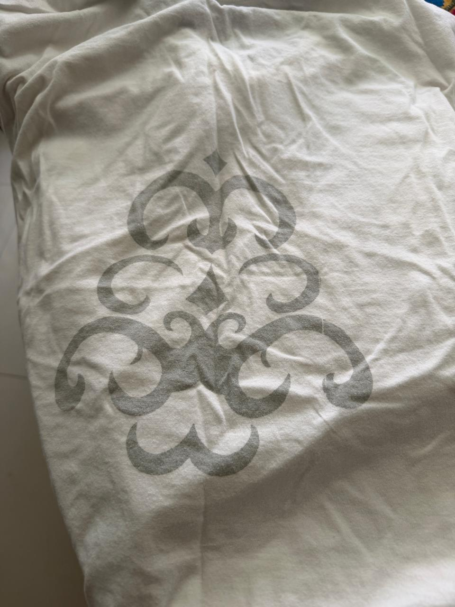

# Fotografías — Práctica de Estampado

Registro visual de la práctica de serigrafía: proceso en laboratorio y resultados de los estampados sobre camiseta blanca.

---

## Proceso en laboratorio

*Figura 1 — Proceso de serigrafía en el laboratorio de fabricación: camiseta blanca extendida sobre la mesa de estampado con diseño ornamental recién impreso. Al fondo, marcos de serigrafía (morado), pistola de calor y tinta.*

---

## Resultados

*Figura 2 — Resultado de estampado: camiseta blanca con patrón geométrico de diamantes en color turquesa. Diseño repetitivo de alta densidad que cubre el centro del pecho.*

*Figura 3 — Resultado de estampado: camiseta blanca con diseño ornamental de volutas barrocas en tinta gris. El diseño es el mismo motivo de la Figura 1 visto a mayor tamaño y en resultado final.*
