# Fotografías

Registro visual del proceso de diseño, fabricación y resultado final del wearable **Golf Sync** — un guante inteligente con retroalimentación háptica para jugadores de golf.

---

## Diseño y concepto

*Figura 1 — Póster de presentación del proyecto Golf Sync: wearable con retroalimentación háptica de precisión, ritmo y rendimiento para cada swing.*

*Figura 2 — Infografía de investigación de usuario sobre la duración real de un guante de golf: análisis de 57 personas, frecuencia de uso y casos reales. Base del problema a resolver.*

---

## Proceso en laboratorio

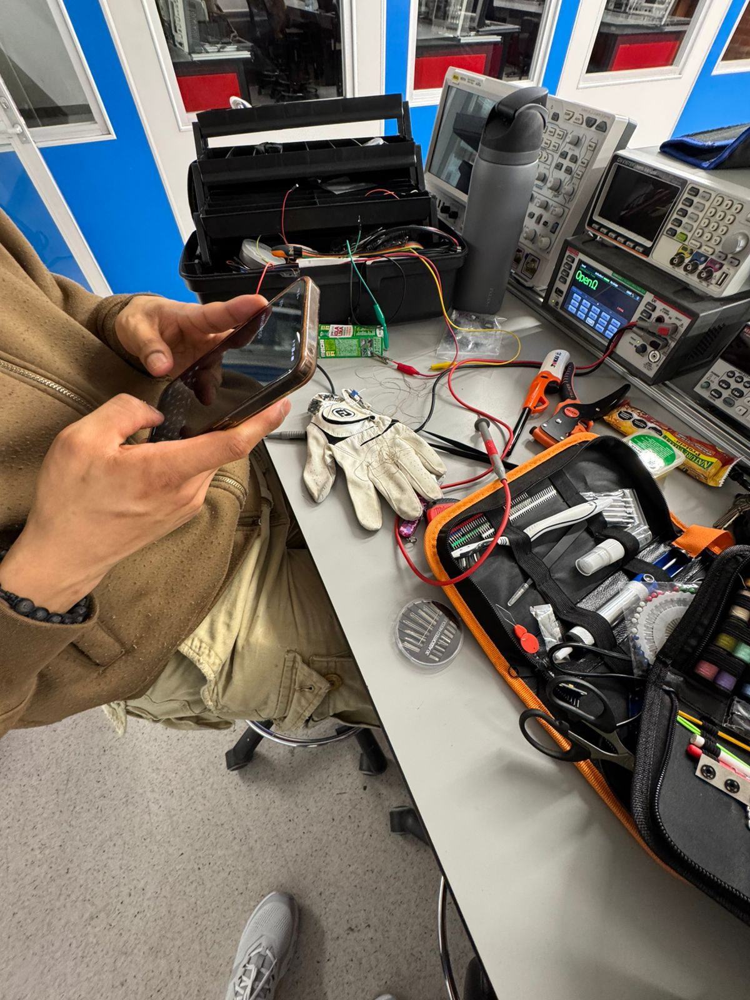
*Figura 3 — Sesión de trabajo en el laboratorio electrónico: prueba de sensores en el guante con osciloscopio y equipo de medición.*

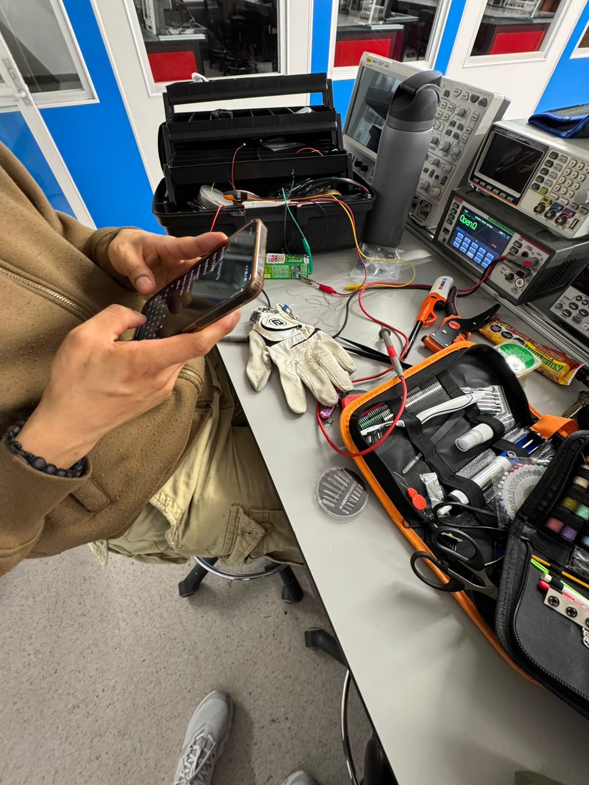
*Figura 4 — Vista general del banco de trabajo durante la sesión de integración electrónica.*

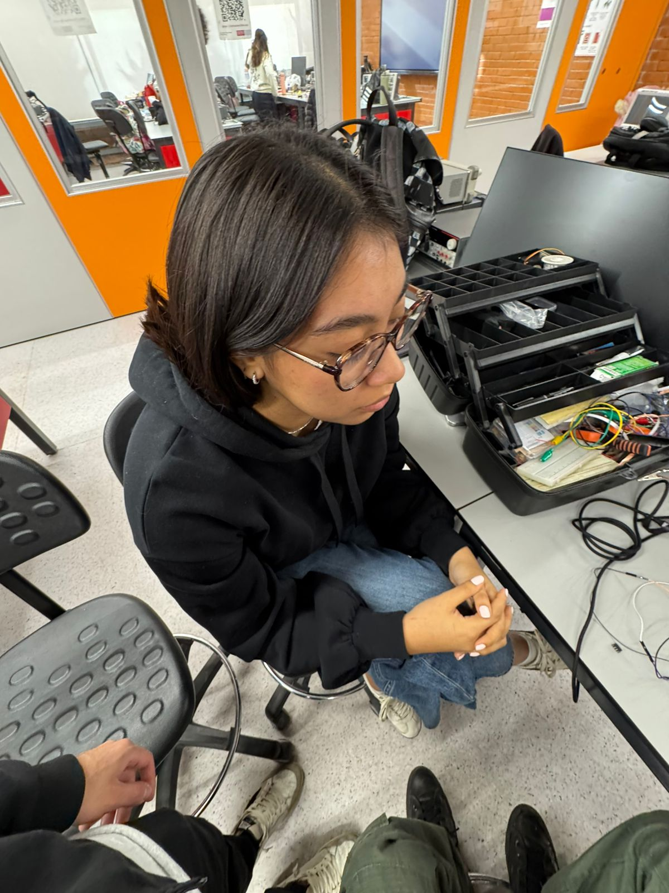
*Figura 5 — Sesión de trabajo en el laboratorio de fabricación: integración de componentes en el guante.*

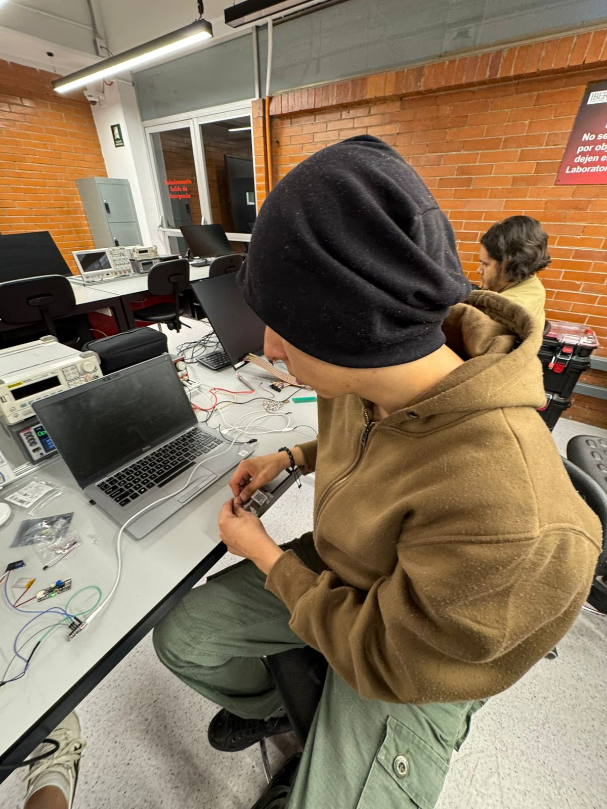
*Figura 6 — Programación y depuración del microcontrolador en el laboratorio de electrónica.*

---

## Implementación electrónica

*Figura 7 — Stack de tarjetas electrónicas: placa de carga de batería UNIT Battery Charger con sensor IMU 10 DOF apilado. Núcleo del sistema de captura de movimiento.*

*Figura 8 — Prueba del sensor de movimiento montado en perfboard, conectado por USB a laptop para validación de lecturas.*

*Figura 9 — Componentes del sistema extendidos en el banco de trabajo: cargador, batería LiPo, pines de sensor flex, módulo motor vibrador y cableado.*

*Figura 10 — Placa cargadora conectada a batería LiPo de 3.7 V: sistema de alimentación autónomo para el wearable.*

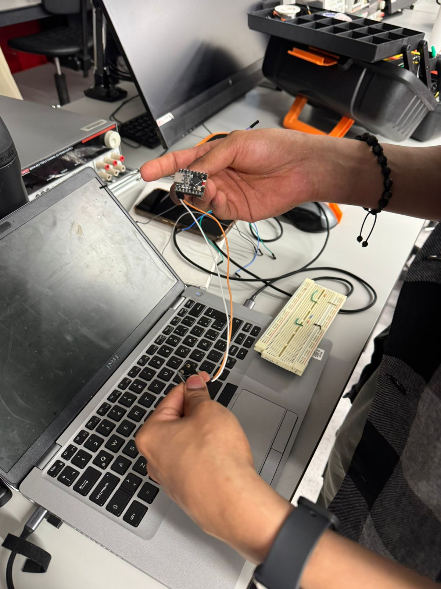
*Figura 11 — Programación del microcontrolador con wires de conexión y breadboard para prototipado rápido de circuitos.*

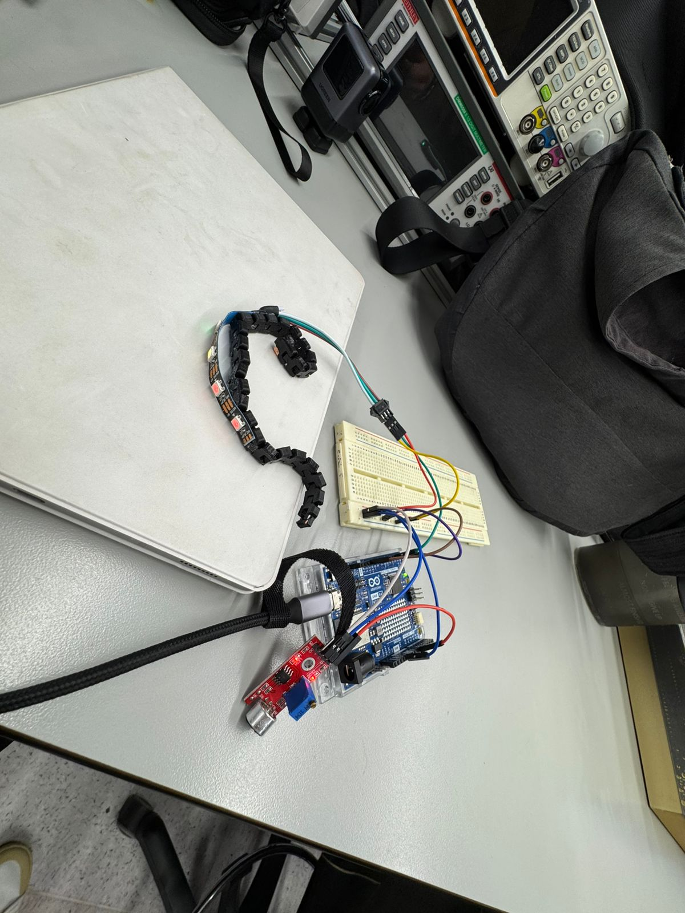
*Figura 12 — Montaje de tira LED NeoPixel conectada a Arduino MKR WiFi mediante breadboard: primera iteración del feedback visual.*

---

## Fabricación

*Figura 13 — Guante de tela negro con módulo electrónico integrado, conectado a fuente de laboratorio para prueba de consumo eléctrico.*

---

## Prototipo v1 — Guante de golf blanco

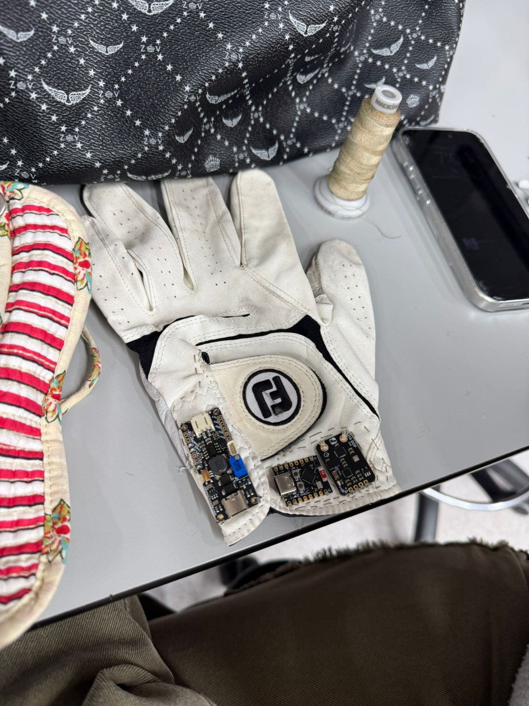
*Figura 14 — Prototipo v1 sobre la mesa de trabajo: guante blanco FootJoy con módulos electrónicos adheridos, vista de la disposición inicial de componentes.*

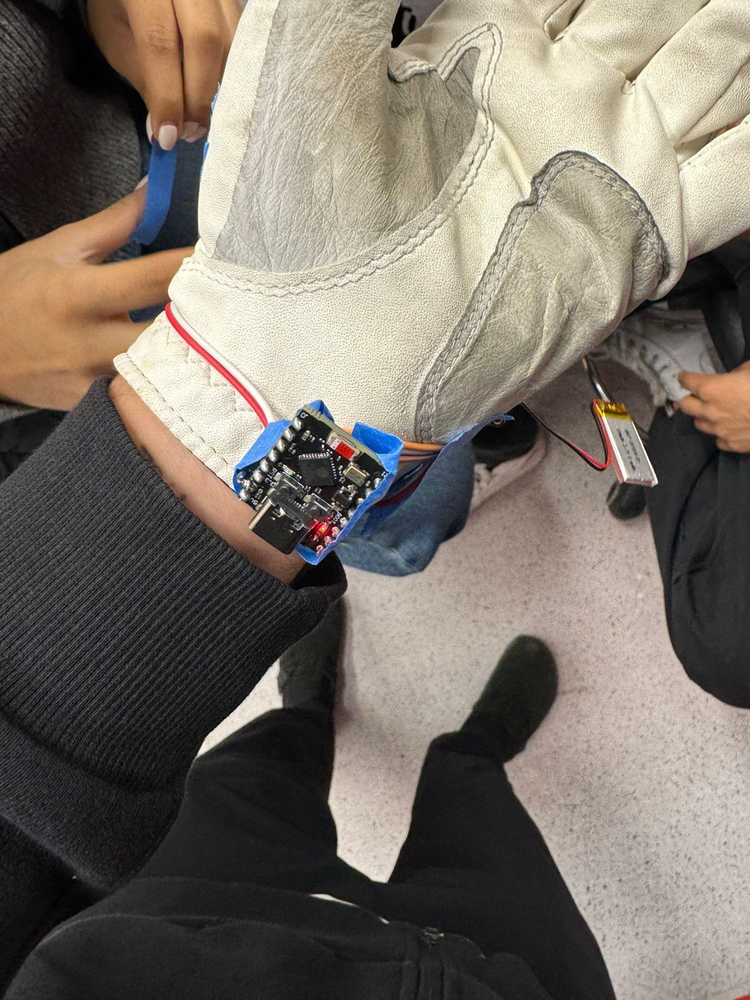
*Figura 15 — Prototipo v1 en muñeca: vista lateral mostrando el sensor IMU y batería LiPo integrados con cinta azul.*

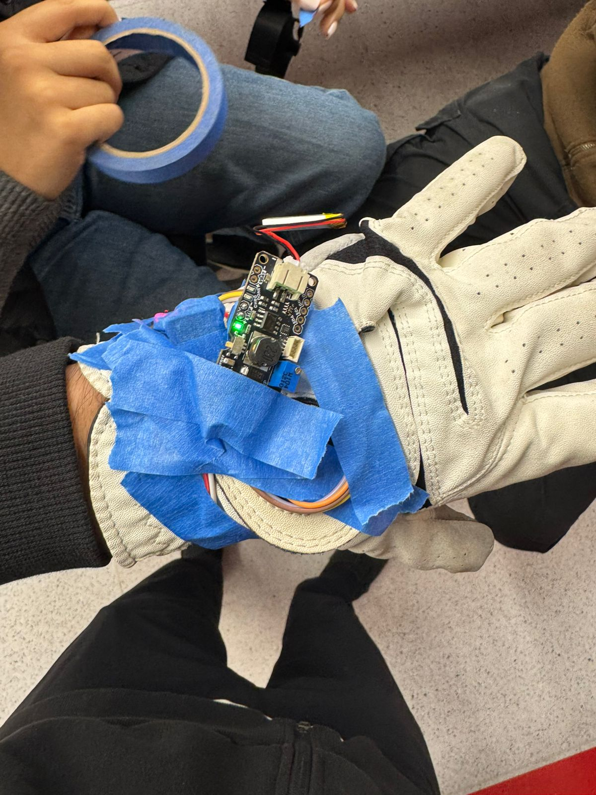
*Figura 16 — Sensor 10 DOF activo sobre el guante: LED rojo indicando funcionamiento del IMU durante prueba de captura de movimiento.*

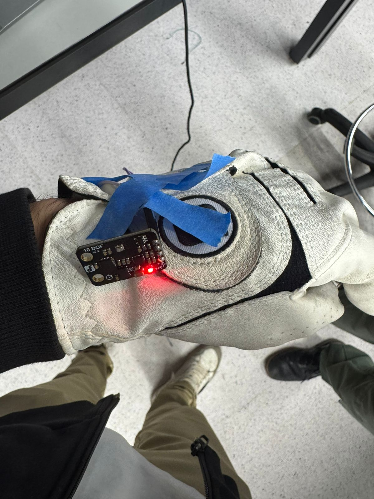
*Figura 17 — Detalle del sensor 10 DOF fijado en la muñeca del guante con cinta azul: posición óptima para captura de ángulo de swing.*

---

## Prototipo v2 — Guante de golf blanco (stack completo)

*Figura 18 — Prototipo v2: guante blanco con stack electrónico completo (IMU + cargador + batería LiPo) integrado con cinta amarilla. Sistema autónomo sin cable USB.*

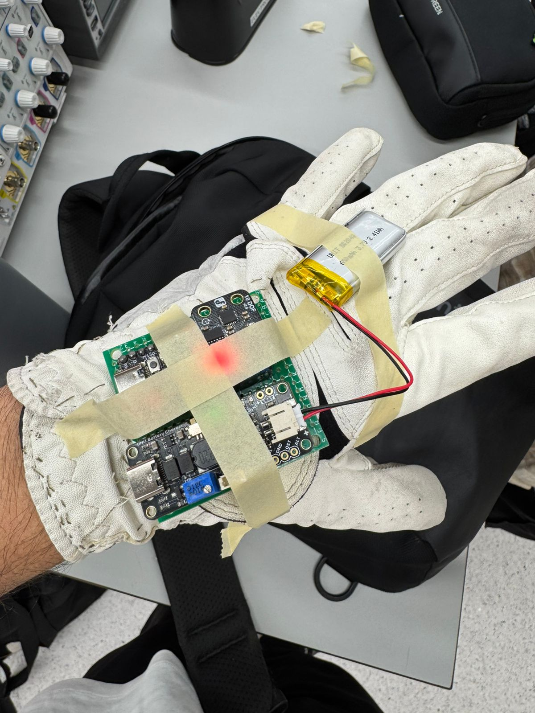
*Figura 19 — Vista dorsal del prototipo v2: disposición de los módulos en el dorso del guante, con LED indicador activo y batería visible.*

---

## Prototipo final — Guante verde (versión textil integrada)

*Figura 20 — Prototipo final: guante verde sin dedos con PCB personalizado integrado en la palma mediante costura. Evolución del concepto hacia un producto más compacto y estético.*

*Figura 21 — Vista lateral del prototipo final: integración del módulo electrónico en el guante verde, mostrando el perfil reducido y la fijación al textil.*

*Figura 22 — Vista del dorso del prototipo final: guante verde cerrado en puño, mostrando el módulo electrónico integrado en el lateral de la muñeca.*
