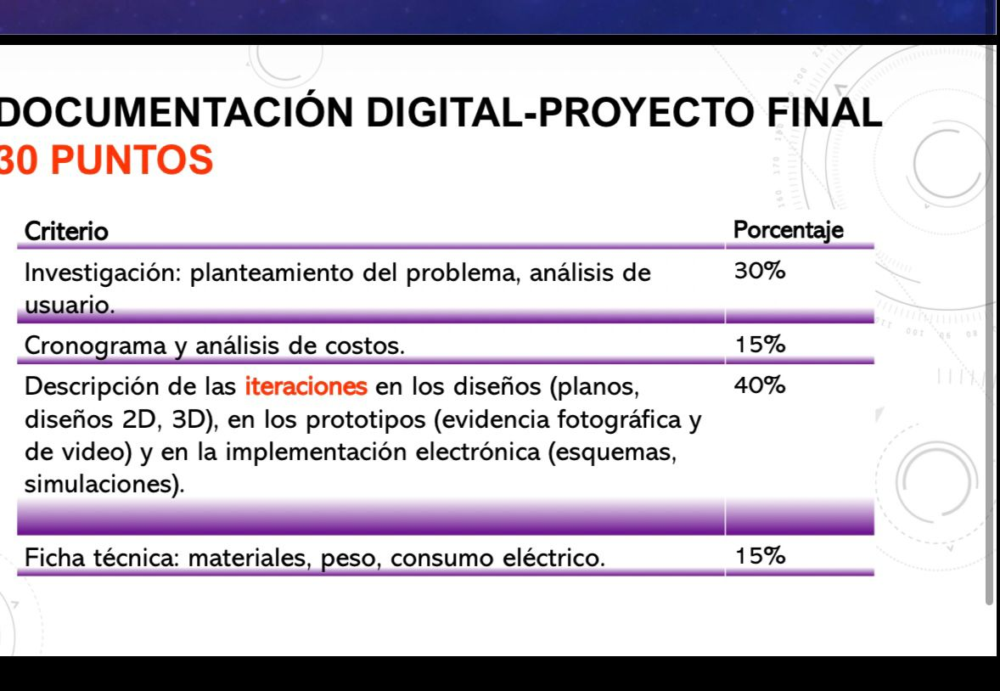
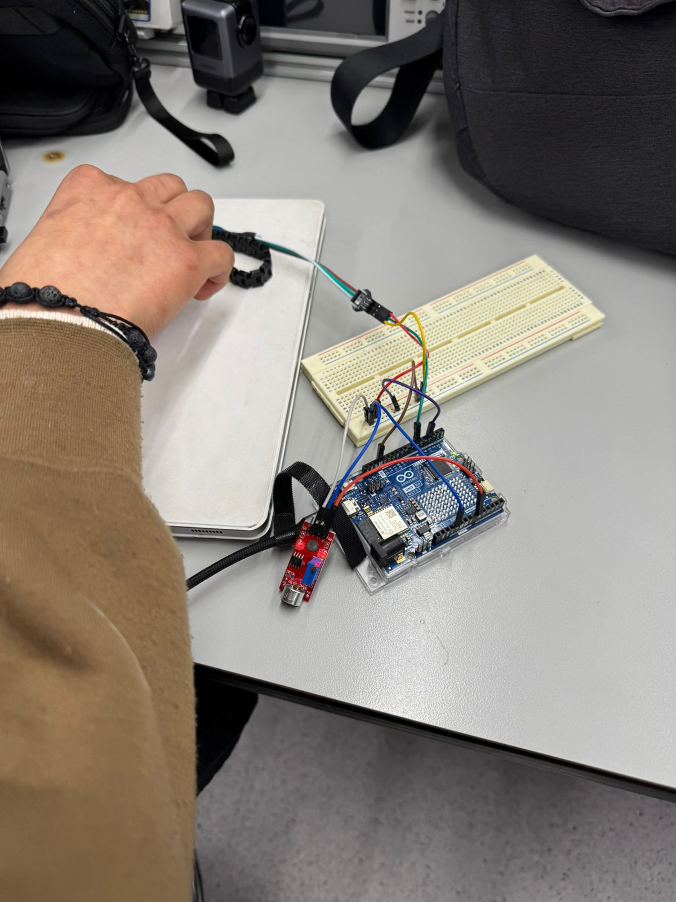
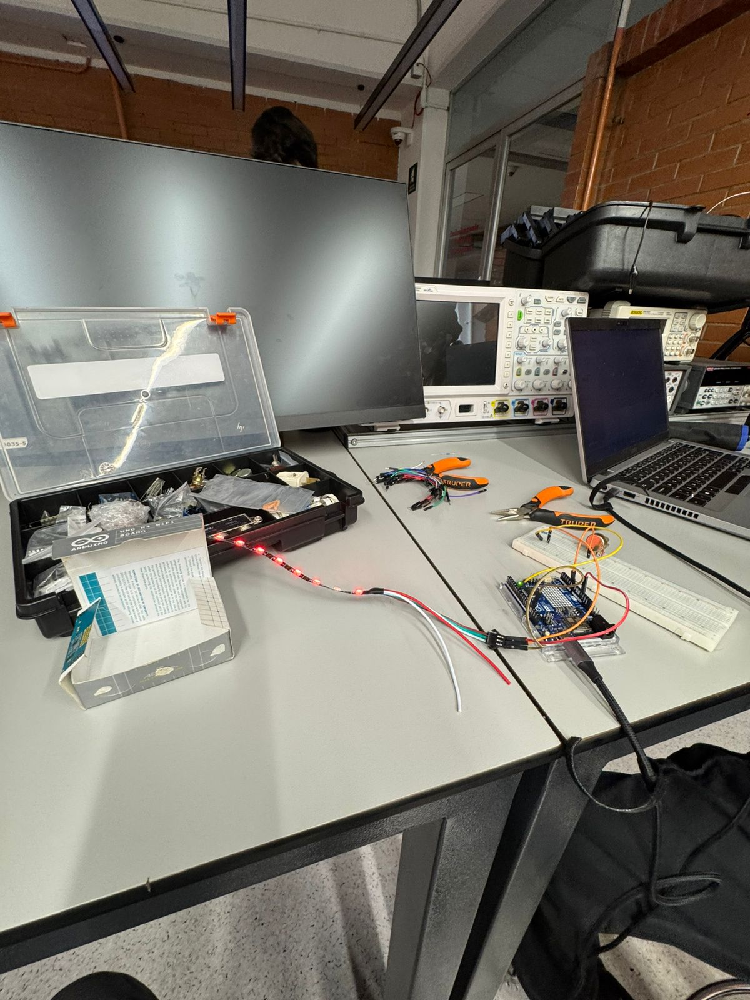
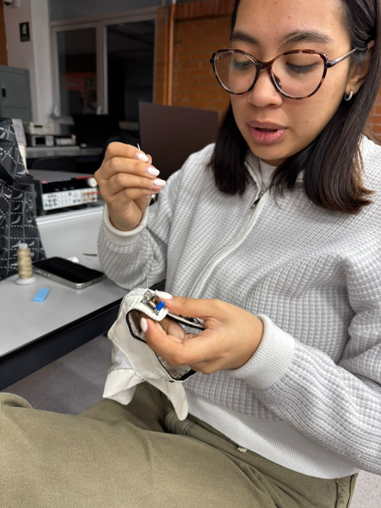
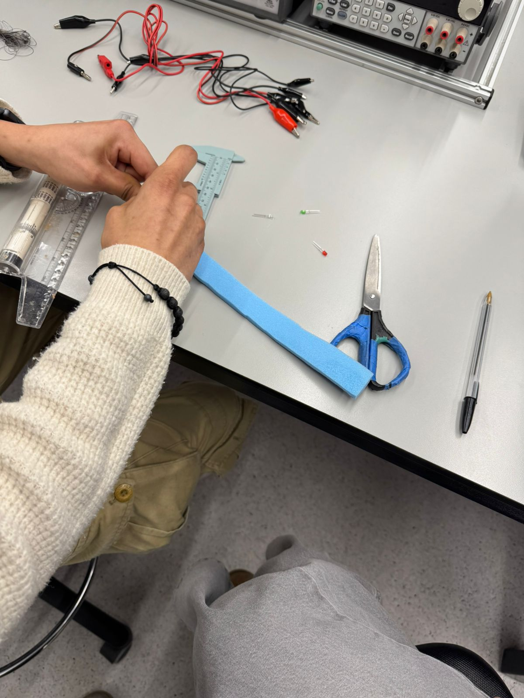
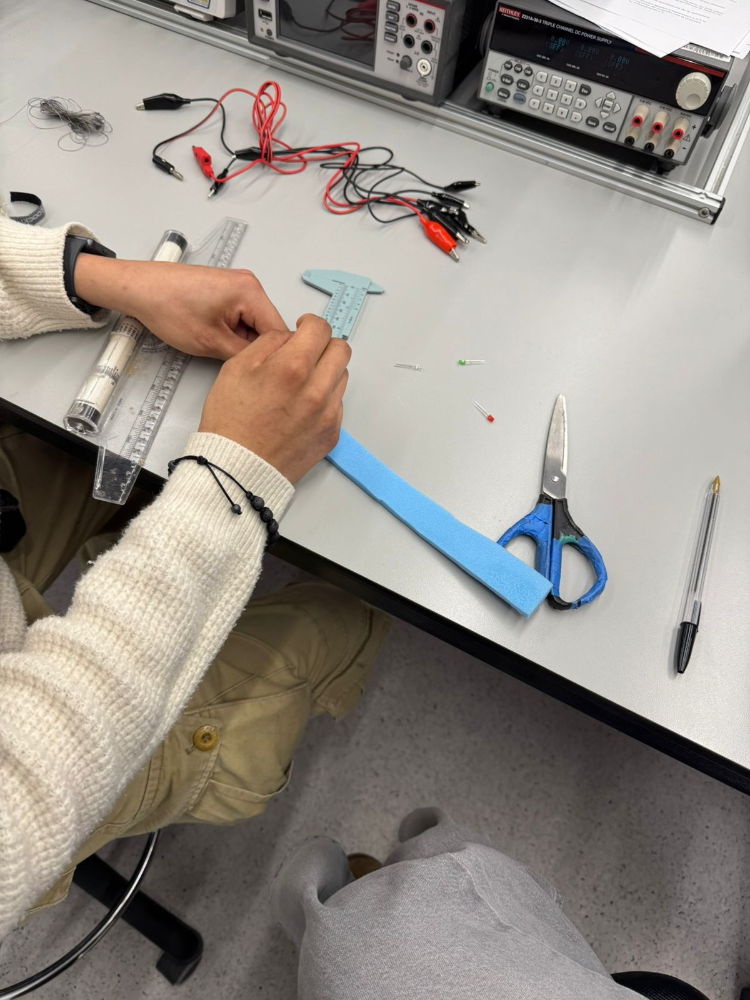

# Fotografías

Registro visual del proceso de diseño, fabricación y resultado final del wearable **Golf Sync** — un guante inteligente con retroalimentación háptica para jugadores de golf.

---

## Diseño y concepto

*Figura 1 — Póster de presentación del proyecto Golf Sync: wearable con retroalimentación háptica de precisión, ritmo y rendimiento para cada swing.*

*Figura 2 — Infografía de investigación de usuario sobre la duración real de un guante de golf: análisis de 57 personas, frecuencia de uso y casos reales. Base del problema a resolver.*

*Figura 3 — Criterios de evaluación del proyecto final (Documentación Digital, 30 puntos): investigación, cronograma, iteraciones y ficha técnica.*

---

## Proceso en laboratorio

*Figura 4 — Sesión de trabajo en el laboratorio electrónico: prueba de sensores en el guante con osciloscopio y equipo de medición.*

*Figura 5 — Vista general del banco de trabajo durante la sesión de integración electrónica.*

*Figura 6 — Sesión de trabajo en el laboratorio de fabricación: integración de componentes en el guante.*

*Figura 7 — Programación y depuración del microcontrolador en el laboratorio de electrónica.*

---

## Implementación electrónica

*Figura 8 — Stack de tarjetas electrónicas: placa de carga de batería UNIT Battery Charger con sensor IMU 10 DOF apilado. Núcleo del sistema de captura de movimiento.*

*Figura 9 — Prueba del sensor de movimiento montado en perfboard, conectado por USB a laptop para validación de lecturas.*

*Figura 10 — Componentes del sistema extendidos en el banco de trabajo: cargador, batería LiPo, pines de sensor flex, módulo motor vibrador y cableado.*

*Figura 11 — Placa cargadora conectada a batería LiPo de 3.7 V: sistema de alimentación autónomo para el wearable.*

*Figura 12 — Programación del microcontrolador con wires de conexión y breadboard para prototipado rápido de circuitos.*

*Figura 13 — Montaje de tira LED NeoPixel conectada a Arduino MKR WiFi mediante breadboard: primera iteración del feedback visual.*

*Figura 14 — Tira LED NeoPixel encendida: validación del control de iluminación desde Arduino.*

*Figura 15 — Tira LED NeoPixel colocada en muñeca durante prueba funcional con la aplicación móvil en primer plano.*

*Figura 16 — Arduino MKR WiFi con breadboard, sensor de movimiento y LED strip: prueba de integración de subsistemas.*

*Figura 17 — Vista general del laboratorio: tira LED, Arduino, breadboard, herramientas y osciloscopio durante sesión de integración.*

*Figura 18 — Tira LED encendida en rojo: prueba de un patrón de retroalimentación visual para señalizar ángulo de swing incorrecto.*

*Figura 19 — Arduino MKR WiFi con breadboard y cableado completo durante sesión de depuración.*

*Figura 20 — Arduino con potenciómetro en breadboard: prueba de ajuste de intensidad de retroalimentación háptica.*

---

## Fabricación

*Figura 21 — Integración de componentes al guante mediante costura: proceso de sujeción de la electrónica al textil con hilo conductor.*

*Figura 22 — Guante de tela negro con módulo electrónico integrado, conectado a fuente de laboratorio para prueba de consumo eléctrico.*

*Figura 23 — Prototipo de banda wearable: foam azul con cinta de cobre conductora y LEDs ensamblados como pista de señal.*

*Figura 24 — Medición precisa de la tira de foam con calibrador para asegurar el ajuste correcto al guante.*

*Figura 25 — Segunda toma del proceso de corte y medición del foam: detalle del uso del calibrador y tijeras.*

---

## Prototipo v1 — Guante de golf blanco

*Figura 26 — Prototipo v1: guante de golf blanco con PCB principal y sensor fijados con cinta azul. Primera versión usable en mano.*

*Figura 27 — Prototipo v1 sobre la mesa de trabajo: guante blanco FootJoy con módulos electrónicos adheridos, vista de la disposición inicial de componentes.*

*Figura 28 — Prototipo v1 en muñeca: vista lateral mostrando el sensor IMU y batería LiPo integrados con cinta azul.*

*Figura 29 — Sensor 10 DOF activo sobre el guante: LED rojo indicando funcionamiento del IMU durante prueba de captura de movimiento.*

*Figura 30 — Detalle del sensor 10 DOF fijado en la muñeca del guante con cinta azul: posición óptima para captura de ángulo de swing.*

---

## Prototipo v2 — Guante de golf blanco (stack completo)

*Figura 31 — Prototipo v2: guante blanco con stack electrónico completo (IMU + cargador + batería LiPo) integrado con cinta amarilla. Sistema autónomo sin cable USB.*

*Figura 32 — Vista dorsal del prototipo v2: disposición de los módulos en el dorso del guante, con LED indicador activo y batería visible.*

---

## Prototipo final — Guante verde (versión textil integrada)

*Figura 33 — Prototipo final: guante verde sin dedos con PCB personalizado integrado en la palma mediante costura. Evolución del concepto hacia un producto más compacto y estético.*

*Figura 34 — Vista lateral del prototipo final: integración del módulo electrónico en el guante verde, mostrando el perfil reducido y la fijación al textil.*

*Figura 35 — Vista del dorso del prototipo final: guante verde cerrado en puño, mostrando el módulo electrónico integrado en el lateral de la muñeca.*
