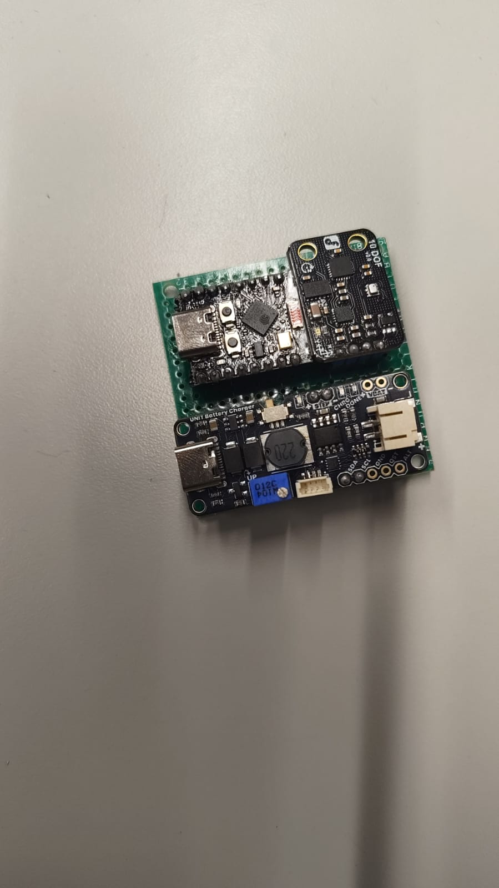
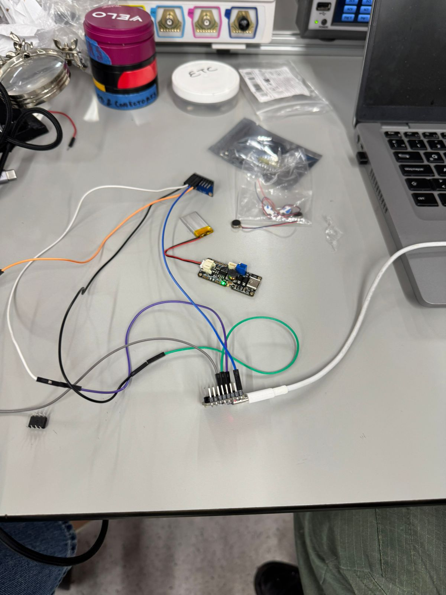
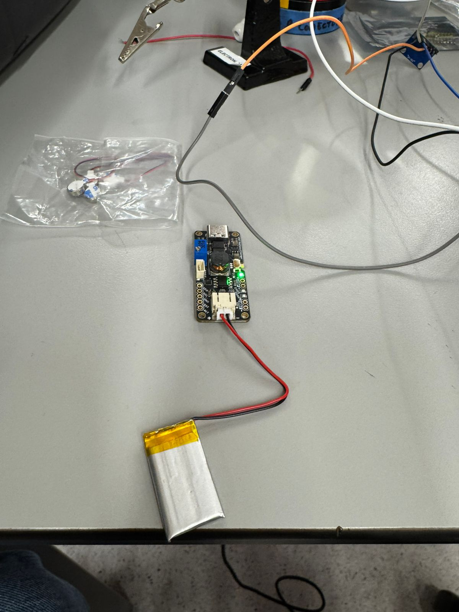

# Implementación electrónica

---

## Ensamblaje del circuito

El circuito se basa en comunicación I2C: los tres sensores (ADXL345, ITG3200, HMC5883L) comparten el mismo bus a 100 kHz, conectados a los pines GPIO 5 (SCL) y GPIO 6 (SDA) del ESP32-C3.

El proceso de ensamblaje fue:

1. Se soldaron pines de 2.54 mm en los módulos que venían sin soldar.
2. Se conectaron SDA/SCL/3V3/GND en paralelo en los tres módulos de sensor usando cables jumper hembra-hembra.
3. El bus I2C se conectó al ESP32-C3.
4. La LiPo se conectó al conector JST del módulo cargador UNIT; el cargador alimenta el ESP32 a 3.3 V.
5. Se verificó continuidad en cada línea con el multímetro antes de encender.


*Figura — Stack ensamblado: módulo IMU 10 DOF (top) + cargador UNIT Battery Charger (bottom), conectados por cables jumper.*

---

## Pruebas de hardware

### Prueba 1 — Verificación de alimentación

| Parámetro | Valor esperado | Valor medido | ¿Pasa? |
|-----------|---------------|--------------|--------|
| Voltaje 3V3 en pins de sensores | 3.3 V | 3.31 V | ✅ |
| Voltaje LiPo (cargada) | 4.1–4.2 V | 4.18 V | ✅ |
| Corriente total en transmisión BLE activa | ~120 mA | ~115 mA | ✅ |

Se midió con fuente de laboratorio y multímetro en serie. El consumo BLE activo confirmó una autonomía estimada ≥4 h con la LiPo de 500 mAh.

### Prueba 2 — Verificación de sensores I2C

Se ejecutó un sketch de scan I2C en el ESP32 para confirmar las direcciones de los tres sensores:

```
I2C device found at address 0x1E  (HMC5883L)
I2C device found at address 0x53  (ADXL345)
I2C device found at address 0x68  (ITG3200)
```

Los tres sensores respondieron correctamente. El bus a 100 kHz fue estable sin errores de NAK durante 5 minutos de lectura continua.


*Figura — Componentes tendidos antes de conectar: cargador, LiPo, sensor flex (descartado), motor vibrador (descartado), cableado.*

### Prueba 3 — Verificación de transmisión BLE y frecuencia de muestreo

Se conectó el teléfono al dispositivo `ESP32_IMU_GOLF` y se capturó una sesión de 30 segundos. Se analizó el CSV resultante:

- **Frecuencia de muestreo real:** ~96–103 Hz (target 100 Hz). El `delay(10)` del firmware produce pequeñas variaciones por el tiempo de cómputo del filtro Madgwick.
- **Pérdida de paquetes BLE:** 0% en las capturas de sesión normal. El chunking de 20 bytes con `delay(1)` entre chunks evita el overflow del buffer BLE.
- **Datos transmitidos por swing:** ~600–1500 muestras por swing detectado (~6–15 segundos de captura), suficiente para extraer los 19 features.


*Figura — LiPo de 3.7 V conectada al cargador UNIT durante una prueba de autonomía.*

### Prueba 4 — Verificación del filtro Madgwick (orientación)

Se verificó que el yaw/pitch/roll producidos por el filtro eran razonables:

- Con el sensor plano sobre la mesa → pitch ≈ 0°, roll ≈ 0°.
- Al rotar el sensor 90° en yaw → yaw cambiaba ~90° en la lectura.
- El `yaw_range` durante un swing real fue de ≈4–6° para buenos swings y ≈5–7° para malos, coherente con la rotación esperada de la muñeca.

---

## Problemas encontrados y correcciones

| Problema | Causa | Corrección |
|----------|-------|------------|
| El ESP32 no detectaba el ADXL345 en la dirección correcta | El módulo tiene un jumper SDO que pone la dirección en 0x53 o 0x1D según el estado; venía configurado en 0x1D | Se soldó el jumper SDO a GND para forzar 0x53 |
| El filtro Madgwick producía yaw errático al inicio | Sin calibración de giroscopio, los offsets en reposo (~3–8 °/s) se acumulaban | Se añadió la función `calibrateGyro(500)` en `setup()`, promediando 500 muestras estáticas para calcular offsets |
| Las lecturas de omega_mag caían a cero entre swings | El delay(10) del loop producía gaps de ~10 ms entre muestras que el Gaussian filter no eliminaba | Se aumentó el sigma del filtro de 1 a 2 en `gaussian_filter1d`, suavizando los artefactos de baja frecuencia |
| El módulo HMC5883L devolvía valores saturados | La inicialización de gain estaba en modo máximo (0x20) | Se configuró en modo ganancia media (0x20 → default 1.3 Ga según hoja de datos) — sin impacto en yaw calculado por Madgwick |

---

## Resultado final del hardware

El hardware funciona de forma estable en sesiones de hasta 1 hora. La frecuencia de muestreo real (~100 Hz) es suficiente para detectar swings y extraer features significativas. El consumo energético valida la LiPo de 500 mAh para sesiones de práctica completas sin recarga. El sistema BLE es confiable dentro del rango de uso esperado (≤5 m del teléfono).

El mayor riesgo pendiente es la fragilidad mecánica de los cables jumper entre módulos. Una versión de producción requeriría un PCB personalizado que integre los tres sensores y el ESP32 en una sola tarjeta soldada.
