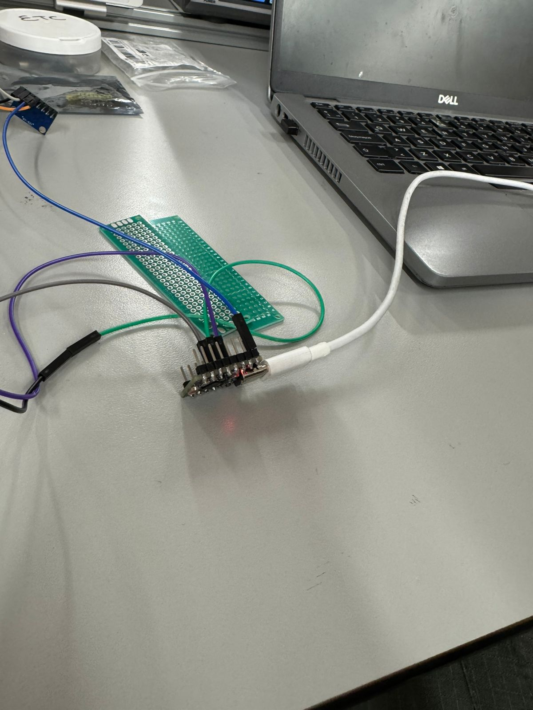
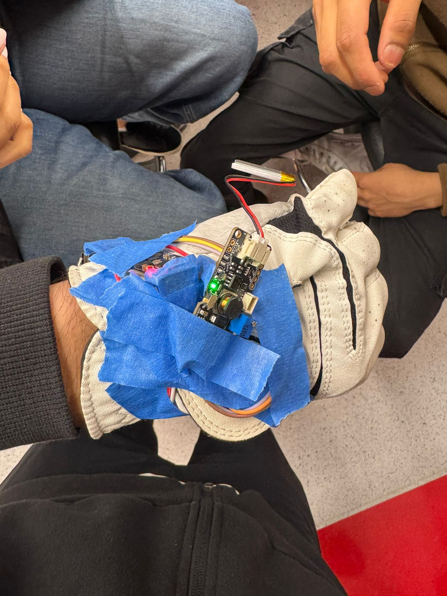
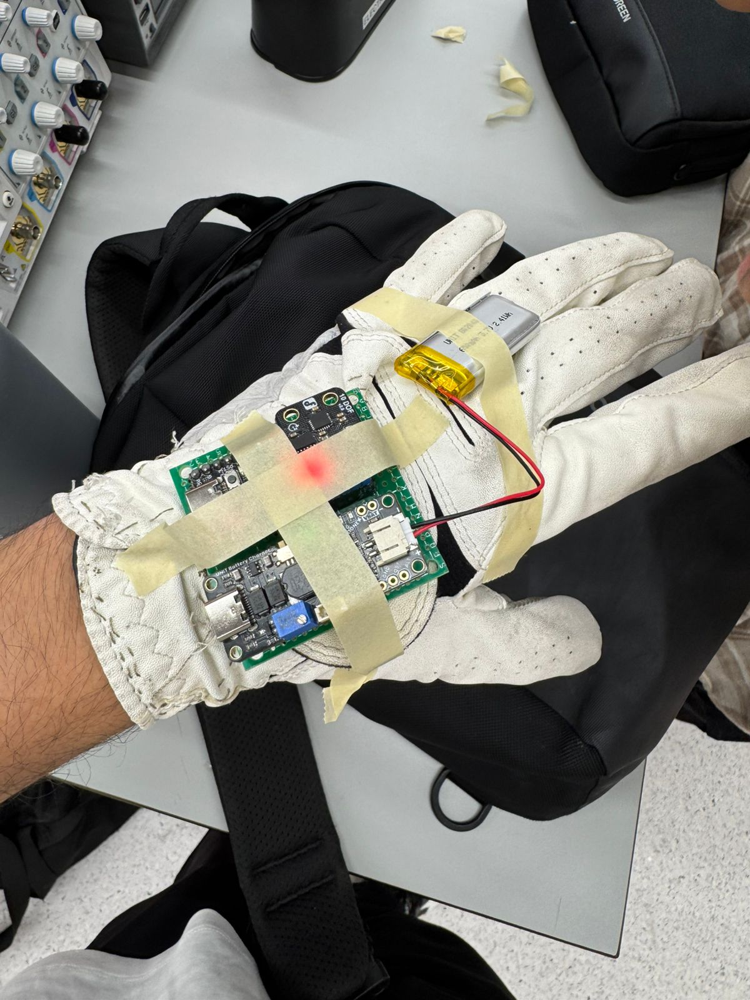
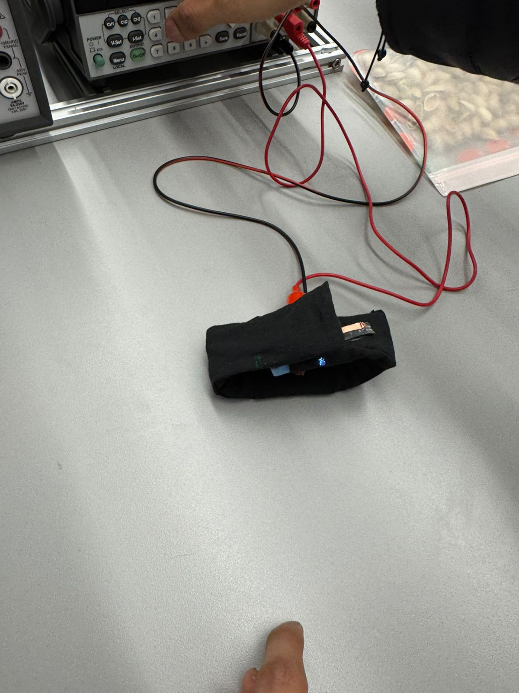
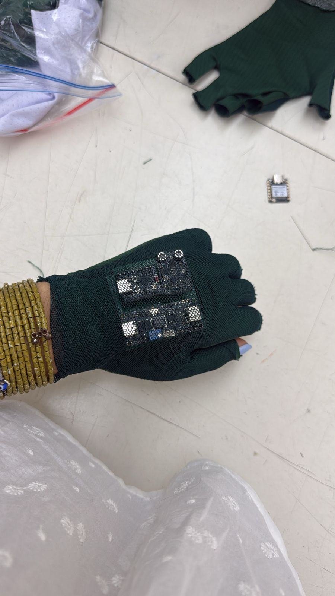
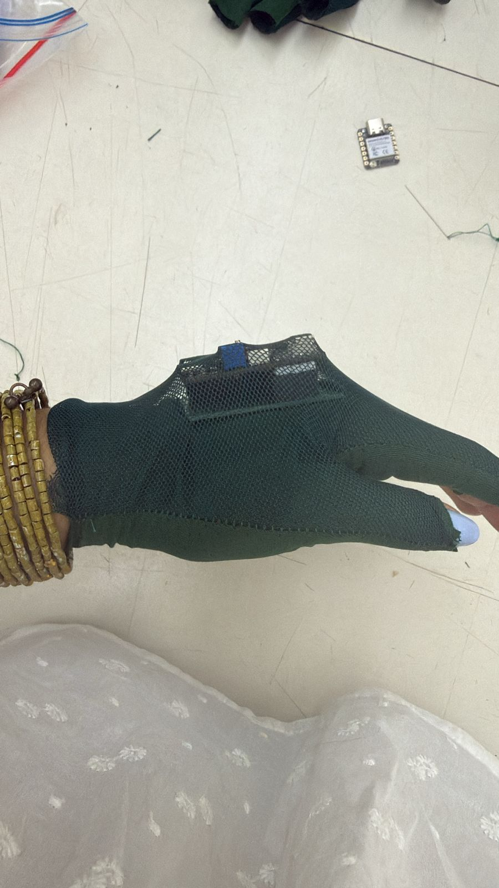
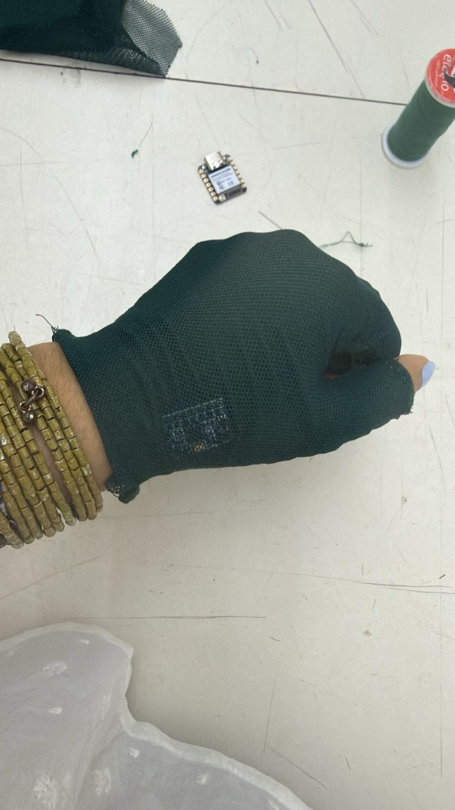

# Procesos de fabricación

---

## Materiales utilizados

| Material | Cantidad | Función |
|----------|----------|---------|
| Guante de golf FootJoy (blanco) | 1 | Soporte físico del prototipo v1 y v2 |
| Guante de tela sin dedos (verde) | 1 | Soporte del prototipo final |
| Módulo IMU 10 DOF (ADXL345 + ITG3200 + HMC5883L) | 1 | Sensor principal |
| Módulo cargador UNIT Battery Charger | 1 | Gestión de carga de la LiPo |
| Batería LiPo 3.7 V ~500 mAh | 1 | Alimentación autónoma |
| Cables jumper macho-hembra cortos | ~10 | Conexiones entre módulos |
| Cinta de masking azul | — | Fijación temporal (v1) |
| Cinta adhesiva amarilla (construcción) | — | Fijación mejorada (v2) |
| Hilo de nylon negro | ~50 cm | Costura definitiva (prototipo final) |
| Snap buttons metálicos (broches) | 4 | Fijación desmontable del PCB al guante |
| Foam azul (EVA) | 1 tira | Prototipo de banda para muñeca (exploración inicial) |
| Cinta de cobre conductora | ~20 cm | Pista de señal en banda de foam |
| Tira LED NeoPixel (WS2812) | 1 | Exploración de feedback visual (proyecto paralelo) |

---

## Herramientas y maquinaria

- Soldador de punta fina y estaño (para pines y cables)
- Pinzas de punta fina (Truper)
- Tijeras de corte textil
- Calibrador digital (para medir el foam y los módulos)
- Máquina de coser / aguja e hilo a mano (prototipo final)
- Multímetro (verificación de continuidad y voltaje)
- Osciloscopio del laboratorio (verificación de señal BLE y pruebas de alimentación)
- Fuente de alimentación regulable de laboratorio (pruebas de consumo eléctrico)
- PC con Arduino IDE y Docker Desktop (programación y backend)

---

## Paso a paso de fabricación

### Paso 1 — Preparación del stack electrónico

Se apilaron el módulo cargador UNIT y el módulo IMU 10 DOF. Los pines I2C (SDA/SCL) y de alimentación (3V3/GND) se conectaron con cables jumper cortos macho-hembra entre los dos módulos y el ESP32-C3. La LiPo se conectó al conector JST del cargador.

Se verificó el funcionamiento del stack en banco antes de montarlo al guante: se encendió el ESP32, se esperó la calibración del giroscopio (~5 s) y se confirmó que el nombre BLE `ESP32_IMU_GOLF` era visible desde el teléfono.

*Figura — Validación del sensor en perfboard antes del ensamblaje al guante.*

### Paso 2 — Ensamblaje del prototipo v1 (cinta azul)

Con el guante FootJoy extendido sobre la mesa, se posicionó el stack electrónico sobre el dorso (metacarpos, zona entre los nudillos y la muñeca). Se fijó con cinta de masking azul cubriendo los cuatro bordes del módulo.

Se verificó que el módulo no interfería con el doblado natural de los dedos al cerrar el puño.

*Figura — Prototipo v1: stack fijado con cinta azul, primera versión usable en mano.*

### Paso 3 — Ensamblaje del prototipo v2 (batería integrada, cinta amarilla)

Se reposicionó la LiPo al lado del stack para eliminar el cable colgante. El conjunto completo (IMU + cargador + LiPo) se aseguró con cinta amarilla de mayor adherencia, cubriendo la totalidad de los componentes.

Este fue el primer prototipo completamente autónomo (sin cable USB durante las sesiones).

*Figura — Prototipo v2: stack completo integrado con cinta amarilla.*

### Paso 4 — Ensamblaje del prototipo final (costura, guante verde)

Se escogió un guante de tela sin dedos como base por su mayor flexibilidad y menor tensión en el dorso al cerrar el puño.

Se marcaron los puntos de costura en el textil con tiza. Se pasaron 4 snap buttons metálicos (2 a cada lado del PCB) a través del guante para crear un sistema de fijación desmontable. Se cosió el perímetro del PCB al textil con hilo de nylon en punto cruzado para distribuir la carga mecánica.

*Figura — Proceso de integración de componentes al guante mediante fijación textil.*

*Figura — Resultado de la costura: PCB integrado directamente al dorso del guante verde.*

---

## Desafíos y soluciones

| Desafío encontrado | Solución aplicada |
|--------------------|-------------------|
| La cinta azul de masking se desprendía con el sudor del guante | Se cambió a cinta amarilla de construcción con adhesivo más fuerte |
| El cable de la LiPo colgaba y se tensaba durante el swing | Se integró la LiPo directamente al parche junto al stack en v2 |
| El guante rígido FootJoy tensaba el dorso al cerrar el puño, despegando la cinta | Se migró a un guante flexible sin dedos en v3 |
| Los módulos I2C tenían pines de diferente paso (2.54 mm vs 2.0 mm) | Se usaron cables jumper hembra en ambos extremos para adaptarlos |
| El ESP32-C3 necesitaba USB-C para programar pero el conector quedaba oculto por la cinta | Se dejó el borde superior del stack sin cubrir para acceder al USB-C |

---

## Resultado físico

| Vista | Imagen |
|-------|--------|
| Palma con PCB integrado |  |
| Vista lateral |  |
| Vista del dorso cerrado en puño |  |
