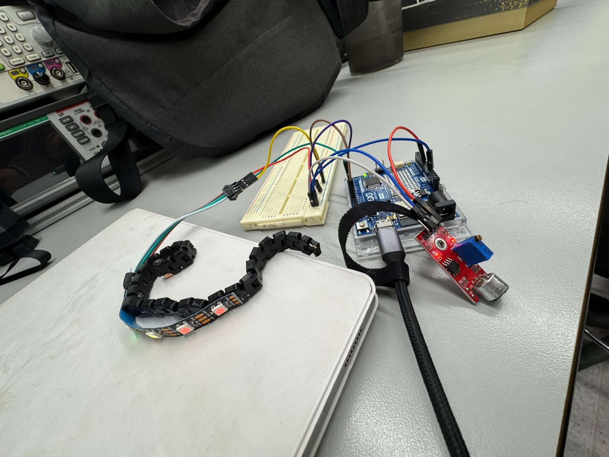
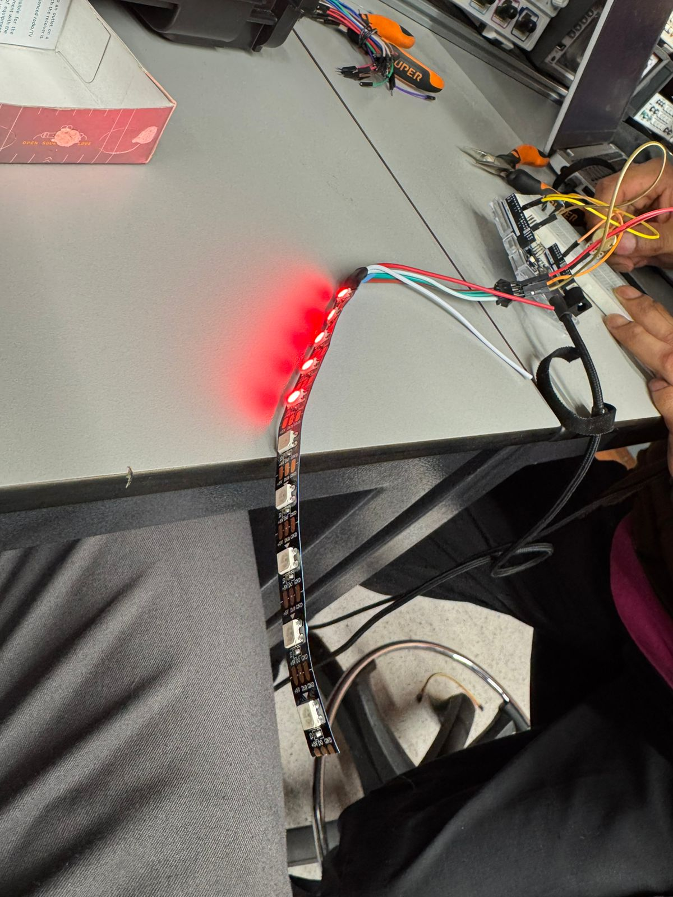
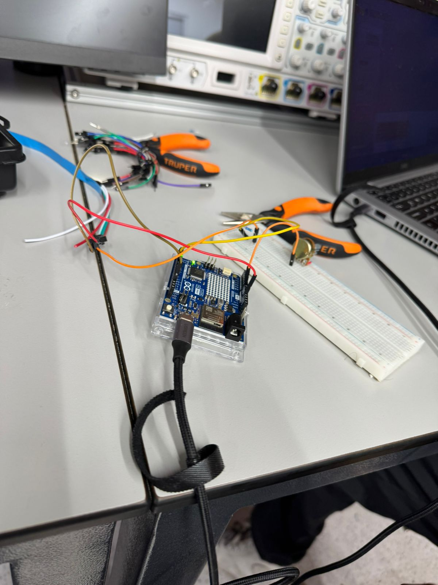
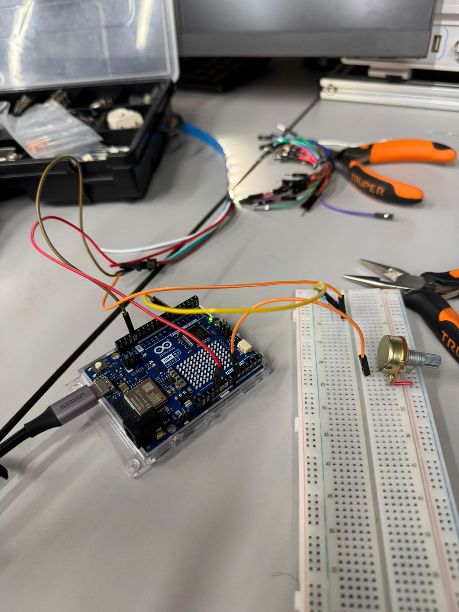
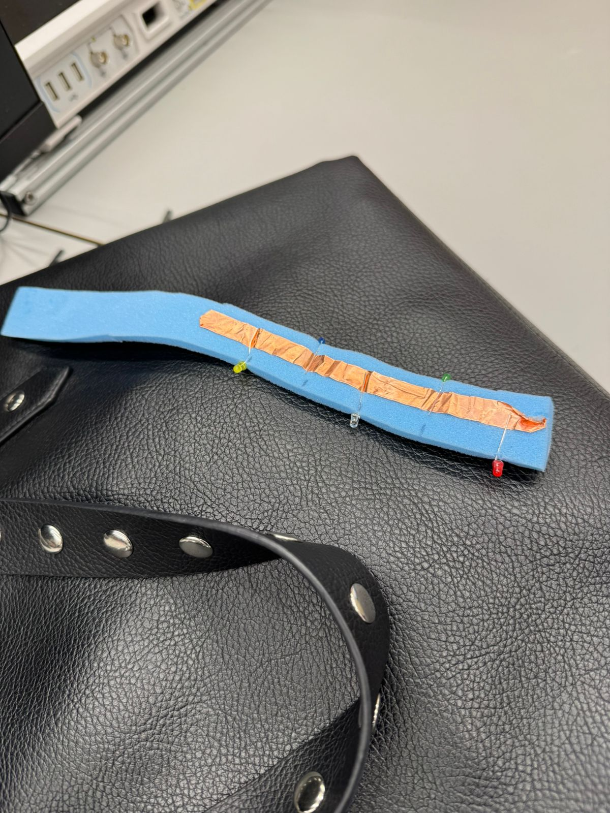
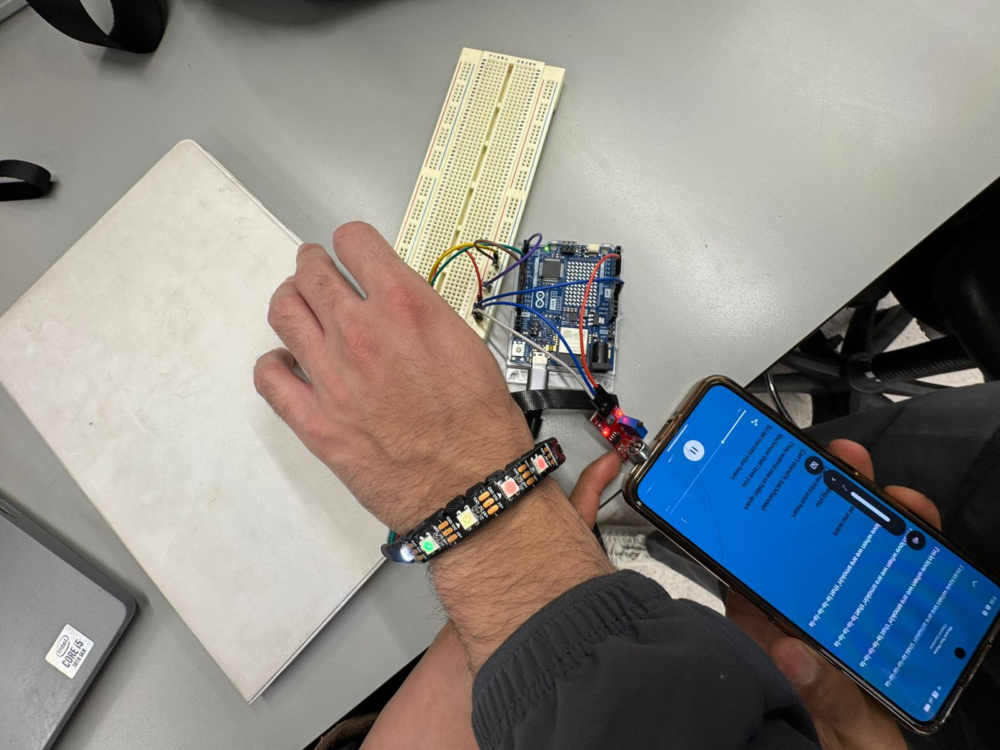

# Fotografías — Pulseras

Registro visual del proceso de diseño, fabricación y prototipado del proyecto de pulseras wearables.

---

## Implementación electrónica

*Figura 1 — Tira LED NeoPixel encendida: validación del control de iluminación desde Arduino.*

*Figura 2 — Tira LED NeoPixel colocada en muñeca durante prueba funcional con la aplicación móvil en primer plano.*

*Figura 3 — Arduino MKR WiFi con breadboard, sensor de movimiento y LED strip: prueba de integración de subsistemas.*

*Figura 4 — Vista general del laboratorio: tira LED, Arduino, breadboard, herramientas y osciloscopio durante sesión de integración.*

*Figura 5 — Tira LED encendida en rojo: prueba de patrón de retroalimentación visual.*

*Figura 6 — Arduino MKR WiFi con breadboard y cableado completo durante sesión de depuración.*

*Figura 7 — Arduino con potenciómetro en breadboard: prueba de ajuste de intensidad.*

---

## Fabricación

*Figura 8 — Proceso de costura e integración de componentes al textil de la pulsera.*

*Figura 9 — Prototipo de pulsera: banda de foam azul con cinta de cobre conductora y LEDs ensamblados como pista de señal.*

*Figura 10 — Medición precisa de la banda de foam con calibrador para asegurar el ajuste correcto a la muñeca.*

*Figura 11 — Segunda toma del proceso de corte y medición del foam: detalle del uso del calibrador y tijeras.*

---

## Prototipo

*Figura 12 — Prototipo de pulsera: primera versión integrada en mano, mostrando el ensamblaje de componentes electrónicos sobre el textil.*

*Figura 13 — Tira LED NeoPixel encendida colocada en la muñeca durante prueba funcional, con Arduino en segundo plano y app móvil en pantalla. Prueba de retroalimentación visual en contexto real de uso.*

*Figura 14 — Prototipo de banda wearable de foam negro con módulo electrónico integrado, conectado a fuente de alimentación regulable para medición de consumo eléctrico.*
